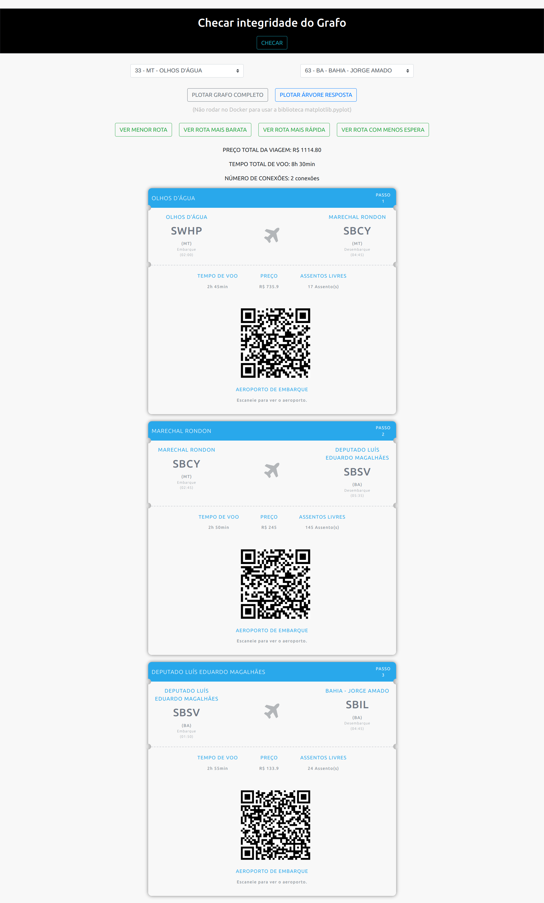
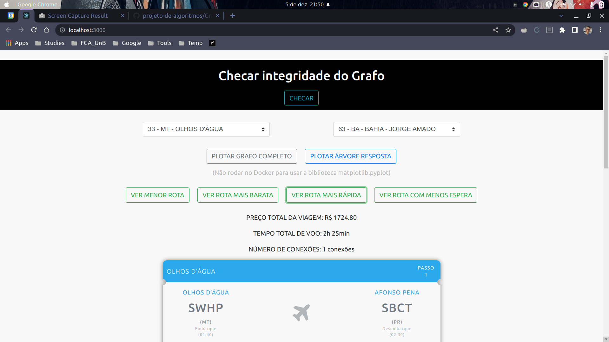
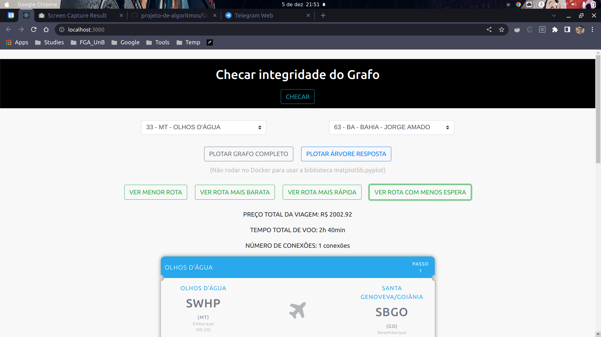

# FlyGraph

**Número da Lista**: 3<br>
**Conteúdo da Disciplina**: Grafos 2<br>

## Alunos
|Matrícula | Aluno |
| -- | -- |
| 19/0089792  |  João Victor Correia de Oliveira |
| 19/0020601  |  Victor Buendia Cruz de Alvim |

## Sobre 
O FlyGraph é uma aplicação web que tem como objetivo verificar a integridade de uma base de dados real de voos da ANAC utizando o conceito de grafos e encontrar o menor caminho entre dois aeroportos brasileiros na base carregada. 

A base de dados coletada foi retirada do [Site de Dados Abertos da ANAC (Agência Nacional de Aviação Civil)](https://www.anac.gov.br/acesso-a-informacao/dados-abertos) para os aeroportos e os voos. Inicialmente coletamos [550 aeroportos](https://sistemas.anac.gov.br/dadosabertos/Voos%20e%20opera%C3%A7%C3%B5es%20a%C3%A9reas/Registro%20de%20servi%C3%A7os%20a%C3%A9reos/2022/11%20-%20Novembro/) e [57 mil voos](https://sistemas.anac.gov.br/sas/tarifadomestica/2022/). A partir disso, utilizamos o [Google Big Query](https://cloud.google.com/bigquery) para, em SQL, limpar a base de aeroportos e voos garantindo que não houvesse voos sem aeroporto e aeroportos sem voo. 


Convertendo os dados de uma planilha (.xlxs) pública para um grafo direcionado, utilizamos o algoritmo de reversão de grafo para checar a conectividade do grafo. Caso ele não seja fortemente conectado, significa que não é possível alcançar todos os outros aeroportos a partir de um aeroporto origem (escolhido arbitrariamente) no grafo original ou no grafo reverso. Para encontrar o menor caminho entre dois destinos foi aplicado o algoritmo de busca em largura (BFS) e o de Dijkstra considerando parâmetros específicos (Preço e Tempo de Voo).

*Easter Egg (:rabbit:): Escaneie os QR Codes das passagens.*

### Explicação das funcionalidades 

**[Checar Integridade]:** Utiliza o algoritmo de BFS no grafo original e grafo reverso para verificar se o grafo é fortemente conectado, caso não seja é exibido qual é a conexão inexistente.

**[Plotar Grafo Completo]:** Utiliza biblioteca do Python para abrir um pop-up mostrando o grafo formado a partir da base de dados completa. 

**[Plotar Árvore Resposta]:** Da mesma forma que o anterior, abre o pop-up da árvore formada a partir dos dois aeroportos escolhidos.

**[Ver menor rota]:** Utiliza o algoritmo de busca em largura (BFS) para encontrar o caminho com menos conexões (arestas) entre os aeroportos de origem e destino.

**[Ver rota mais barata]:** Utiliza o algoritmo de Dijkstra considerando o preço como parâmetro para encontrar caminho mais barato entre a origem e o destino escolhidos.

**[Ver rota mais rápida]:** Utiliza o algoritmo de Dijkstra considerando o tempo de voo  como parâmetro para encontrar caminho mais rápido da origem ao destino.

**[Ver rota com menos espera]:** Utilizar o algoritmo de Dijkstra considerando o tempo de voo como parâmetro para encontrar o caminho mais rápido da origem ao destino, mas fazendo a checagem de integridade na qual a diferença do tempo de desembarque de um voo até o embarque do próximo é de, no mínimo, 60 minutos.

## Screenshots
### Caminho Mais Barato


### Caminho Mais Rápido


### Caminho de Menos Espera


## Vídeo de Apresentação

## Instalação 
**Linguagem**: Python(Back-end) e JavaScript(Front-End) <br>
**Framework**: Django Rest e React <br>

#### Opção 1- Utilizando Docker

**:alert: Para usar os botões de PLOTAR GRAFO, é preciso rodar a Opção 2- Para desenvolvimento. Isso é preciso para rodar a biblioteca matplotlib.pyplot na sua máquina.**
```
sudo docker-compose up --build
```
#### Opção 2- Para desenvolvimento 
```
cd djangoConfig/
pip install requirements.txt
```
 
Como desenvolvimento é necessário entrar no arquivo frontend/services/api.js e alterar a URL de requisições para a porta do Django: 
```
  baseURL: 'http://127.0.0.1:8000/'
```
```
cd frontend/
sudo npm i
npm run build

cd .. 

python3 manage.py runserver
```

## Uso 
Opção 1 - Após executar o comando de build do docker, basta acessar a url: http://localhost:3000/
Caso seja necessário subir novamente o container:
```
sudo docker-compose up 
```

Opção 2 - Após instalar as dependências e rodar o server python, basta acessar a url: http://127.0.0.1:8000/

## Outros 
Quaisquer outras informações sobre seu projeto podem ser descritas abaixo.

Se tiver problema com o front, delete o `node_modules` e `package-lock.json`.


